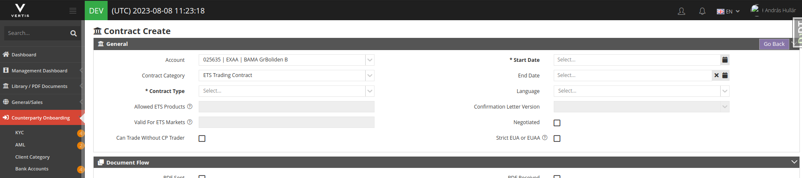
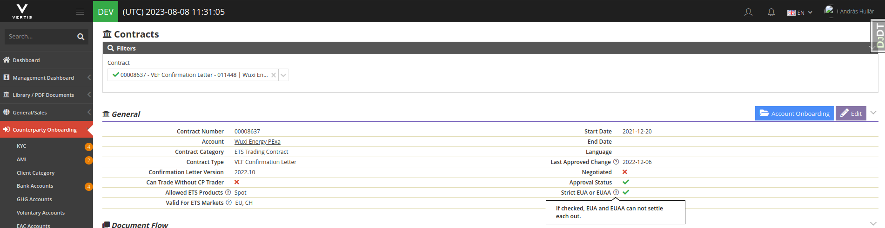

- Changes
	- Contract
		- Create view
			- 
				- There is a `Strict EUA or EUAA` checkbox visible on the page
				- Checkbox visible if `ETS Trading Contract` was selected
				- In case it's modified on an approved contract the approval will be revoked.
		- Detail view
			- {:height 194, :width 718}
			- In the General section the contract's `Strict EUA or EUAA` settings visible
- ETS Offer
	- When EUA / EUAA product was choosen a checkbox appears next to the product
		- the checkbox value is the same as the value on the contract but it can be modified
- ETS Offer List