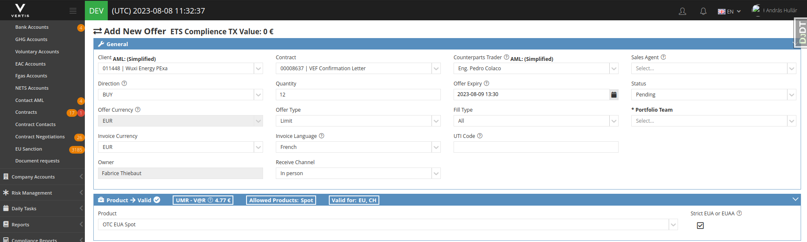
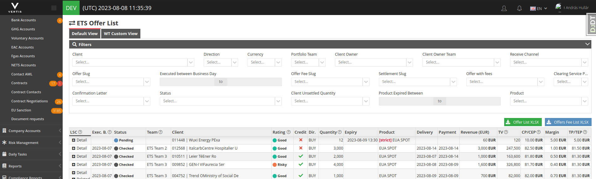
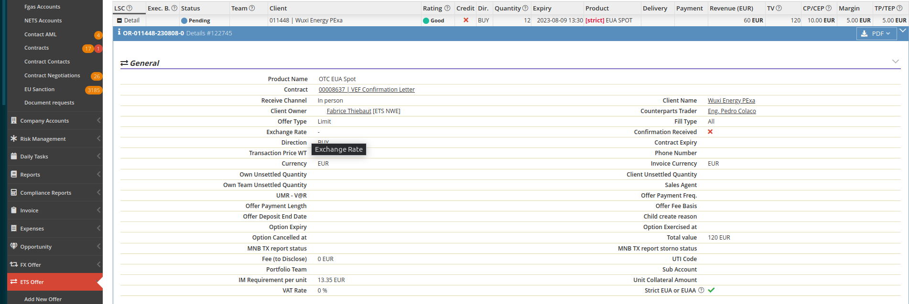
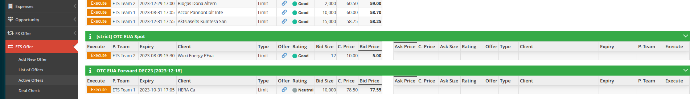
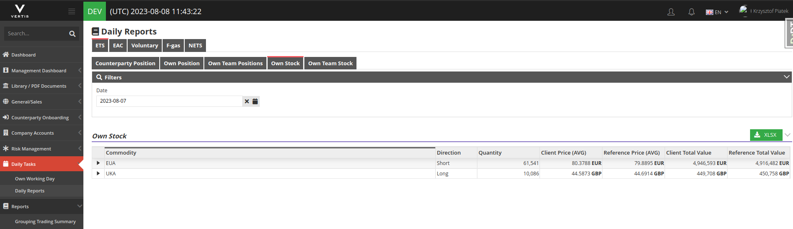
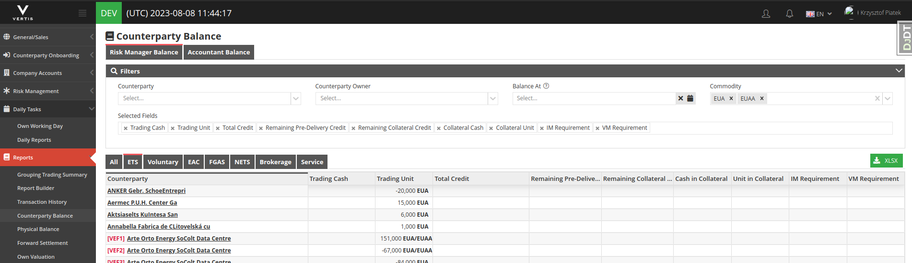
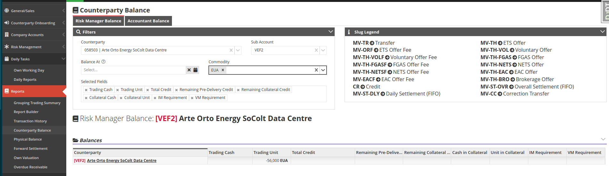
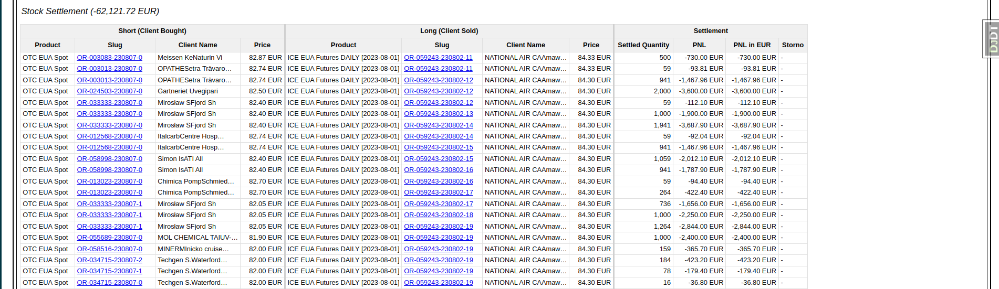

- Changes
	- Contract
		- Create view
			- 
			- There is a `Strict EUA or EUAA` checkbox visible on the page
			- Checkbox visible if `ETS Trading Contract` was selected
			- In case it's modified on an approved contract the approval will be revoked.
		- Detail view
			- {:height 194, :width 718}
			- In the `General` section the contract's `Strict EUA or EUAA` settings visible
	- ETS Offer
		- Add new ETS Offer
			- 
			- When EUA / EUAA product was choosen a `Strict EUA or EUAA` checkbox appears next to the product
			- The checkbox's value by default coming from the contract but it can be modified during contract creation
		- ETS Offer List
			- {:height 215, :width 687}
				-
			- In case of a "Strict EUA or EUAA" offer the `ETS Offer List` page the `[strict]` string in red appears before the product
		- ETS Offer Details
			- 
			- The `Strict EUA or EUAA` visible on ETS Offer Details page
		- Active Offers
			- 
			- `Acknowledge` "Strict EUA or EUAA" offers visible in separate section
	- Own Stock
		- {:height 216, :width 718}
			- After `Close day` the EUA and EUAA offers will be merged under EUA
		- 
			- Commodity was added to `Settlements` table
			- The "Buy" and "Sell" details colored so they are easier to recognize
	- Counterparty Balance
		- 
		- Commodity is multichoice field
		- Choosing the EUA and EUAA the system merges the balances
		- 
		- One Account's balance
		- 
			- If the EUA was selected as Commodity
		- 
			- If the EUAA was selected as commodity
	- Own Valuations
		- 
		- `id` and `Client Code` removed from the table as following the order's link show these details